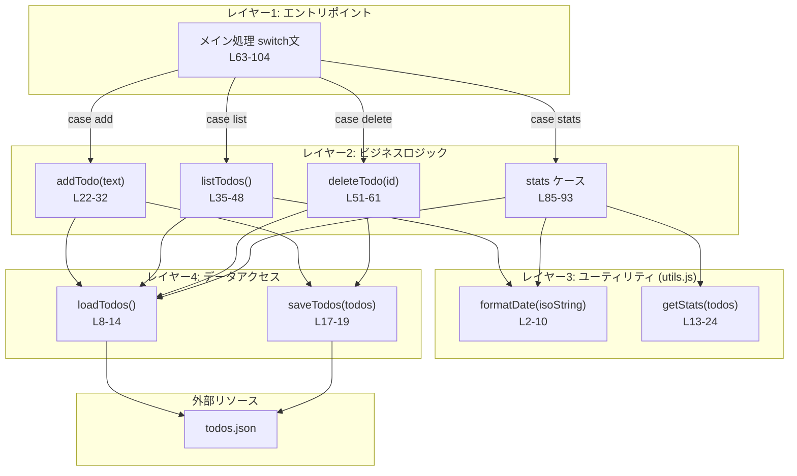
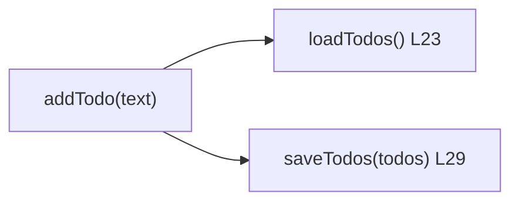
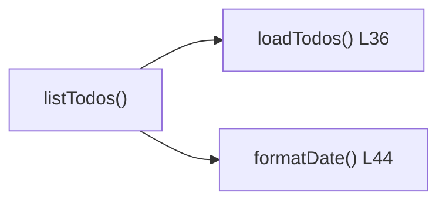
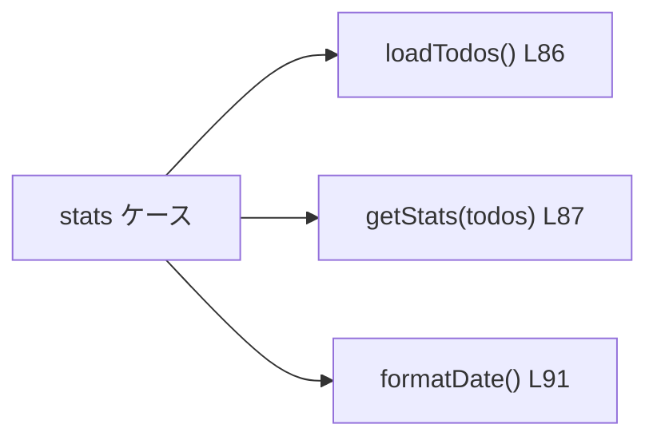
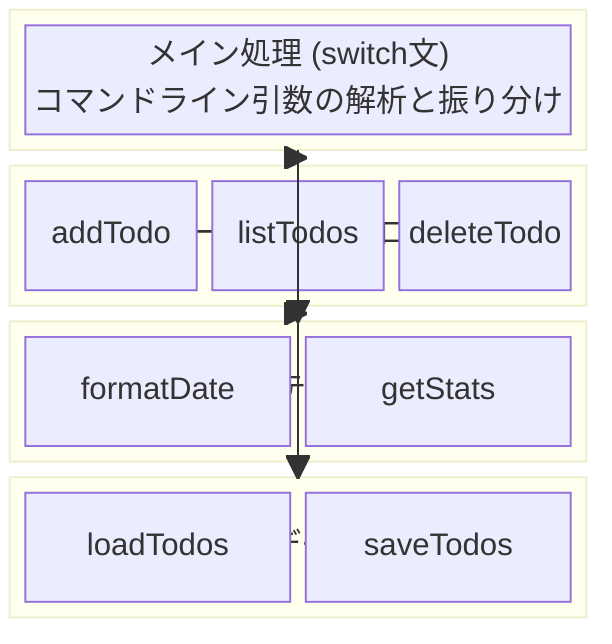

# 技術ドキュメント — 関数の依存関係

## 1. 概要

本ドキュメントでは `index.js` および `utils.js` における関数の依存関係を定義します。

---

## 2. モジュール依存関係

`index.js` が依存しているモジュールの一覧です。

| # | モジュール | 種別 | 参照方法 | 用途 |
|---|----------|------|---------|------|
| 1 | `fs` | Node.js 標準 | `require("fs")` | ファイルの読み書き |
| 2 | `path` | Node.js 標準 | `require("path")` | ファイルパスの組み立て |
| 3 | `utils.js` | プロジェクト内 | `require("./utils")` | 日付フォーマット・統計処理 |

### 2.1 `utils.js` からのインポート

```javascript
const { formatDate, getStats } = require("./utils");
```

| # | 関数名 | 利用元 |
|---|--------|-------|
| 1 | `formatDate` | `listTodos()`, メイン処理 (`stats`) |
| 2 | `getStats` | メイン処理 (`stats`) |

---

## 3. 関数一覧

### 3.1 index.js の関数

| # | 関数名 | 定義行 | レイヤー | 役割 |
|---|--------|--------|---------|------|
| 1 | `loadTodos()` | L8-14 | データアクセス | TODO データの読み込み |
| 2 | `saveTodos(todos)` | L17-19 | データアクセス | TODO データの保存 |
| 3 | `addTodo(text)` | L22-32 | ビジネスロジック | TODO の追加 |
| 4 | `listTodos()` | L35-48 | ビジネスロジック | TODO の一覧表示 |
| 5 | `deleteTodo(id)` | L51-61 | ビジネスロジック | TODO の削除 |
| — | メイン処理 (switch) | L63-104 | エントリポイント | コマンド解析と関数呼び出し |

### 3.2 utils.js の関数

| # | 関数名 | 定義行 | レイヤー | 役割 |
|---|--------|--------|---------|------|
| 1 | `formatDate(isoString)` | L2-10 | ユーティリティ | ISO 日付を表示用に変換 |
| 2 | `getStats(todos)` | L13-24 | ユーティリティ | TODO の統計情報を算出 |

---

## 4. 関数間の依存関係

### 4.1 依存関係マトリクス

行の関数が、列の関数を **呼び出している** ことを示します。

| 呼び出し元 ＼ 呼び出し先 | loadTodos | saveTodos | formatDate | getStats |
|--------------------------|:---------:|:---------:|:----------:|:--------:|
| **addTodo** | ○ | ○ | | |
| **listTodos** | ○ | | ○ | |
| **deleteTodo** | ○ | ○ | | |
| **メイン処理 (stats)** | ○ | | ○ | ○ |

### 4.2 関数呼び出しの依存関係図



### 4.3 各関数の依存詳細

#### addTodo(text)



| # | 呼び出し先 | 呼び出し箇所 | 目的 |
|---|-----------|-------------|------|
| 1 | `loadTodos()` | L23 | 既存の TODO 配列を取得 |
| 2 | `saveTodos(todos)` | L29 | TODO 追加後の配列を保存 |

#### listTodos()



| # | 呼び出し先 | 呼び出し箇所 | 目的 |
|---|-----------|-------------|------|
| 1 | `loadTodos()` | L36 | 表示する TODO 配列を取得 |
| 2 | `formatDate()` | L44 | `createdAt` を `YYYY/MM/DD HH:mm` に変換 |

#### deleteTodo(id)


| # | 呼び出し先 | 呼び出し箇所 | 目的 |
|---|-----------|-------------|------|
| 1 | `loadTodos()` | L52 | 削除対象を検索するための配列を取得 |
| 2 | `saveTodos(todos)` | L59 | 削除後の配列を保存 |

#### メイン処理 stats ケース (L85-93)



| # | 呼び出し先 | 呼び出し箇所 | 目的 |
|---|-----------|-------------|------|
| 1 | `loadTodos()` | L86 | 統計算出用の配列を取得 |
| 2 | `getStats(todos)` | L87 | 件数と最新 TODO を算出 |
| 3 | `formatDate()` | L91 | 最新 TODO の日時を表示用に変換 |

---

## 5. レイヤー構造

関数は 4 つのレイヤーに分類されます。上位レイヤーは下位レイヤーに依存しますが、下位から上位への依存はありません。



### 5.1 レイヤー間の依存ルール

| # | ルール | 説明 |
|---|--------|------|
| 1 | 上位 → 下位のみ | レイヤー 1 は 2, 3, 4 を呼べる。逆方向の依存はない |
| 2 | 同一レイヤー間の依存なし | 例: `addTodo` は `listTodos` を呼ばない |
| 3 | レイヤー 3 と 4 は独立 | `formatDate` は `loadTodos` を呼ばない。逆も同様 |

---

## 6. 定数・グローバル変数

| # | 名前 | 定義行 | 型 | 値 | 依存先 |
|---|------|--------|-----|-----|--------|
| 1 | `DATA_FILE` | L5 | string | `<__dirname>/todos.json` | `path.join`, `__dirname` |
| 2 | `command` | L64 | string | `process.argv[2]` | `process.argv` |
| 3 | `argument` | L65 | string | `process.argv[3]` | `process.argv` |

`DATA_FILE` は `loadTodos()` と `saveTodos()` の両方から参照されるモジュールレベルの定数です。
