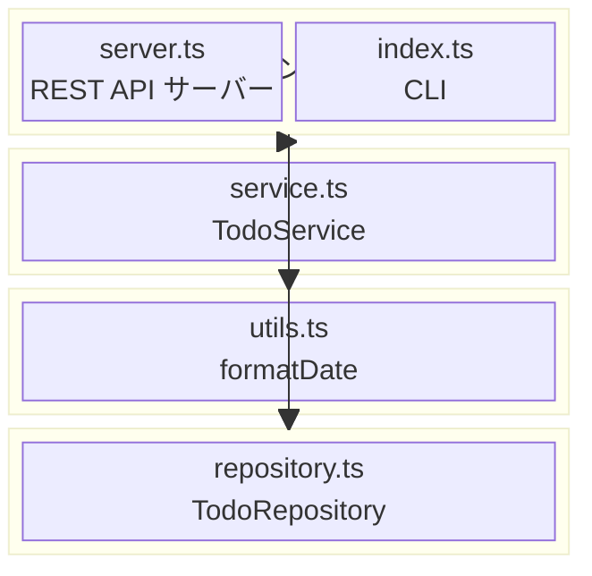
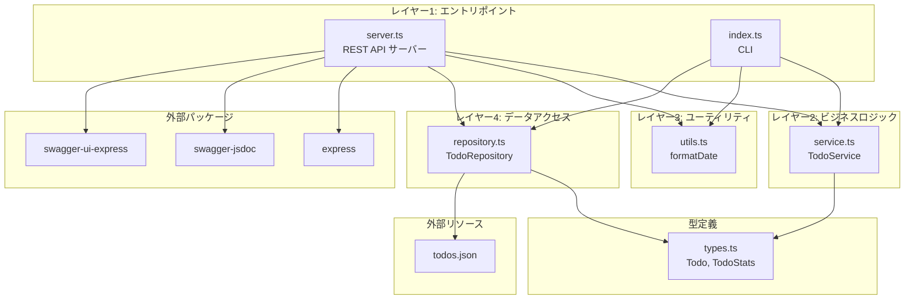
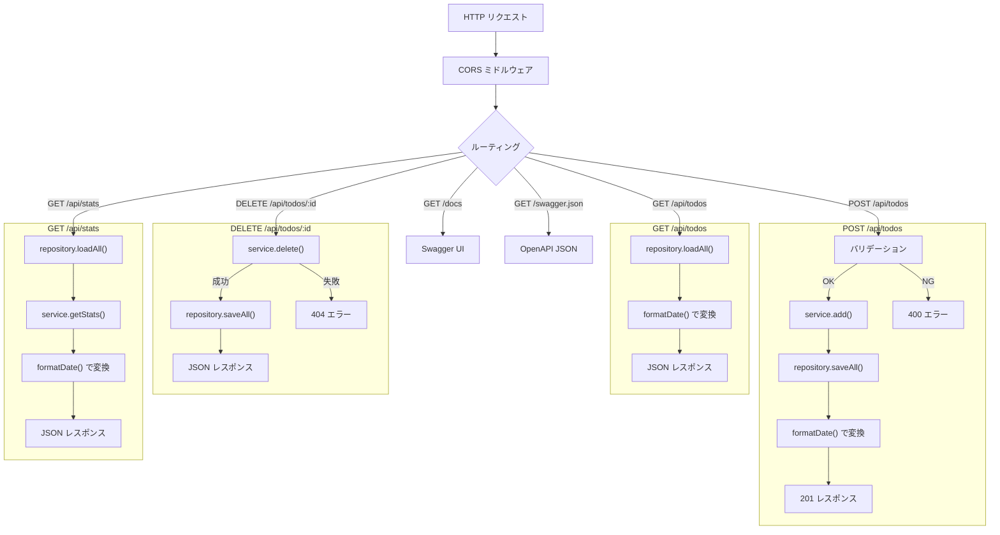
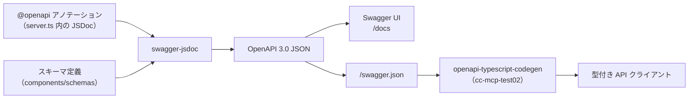
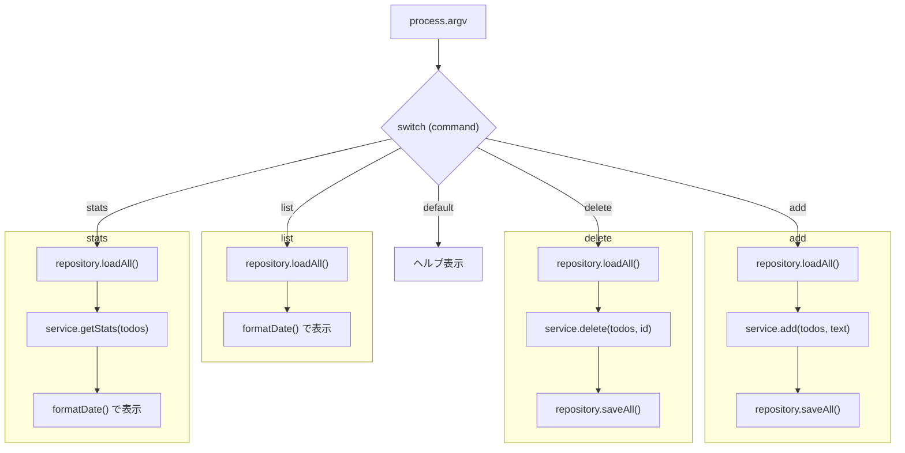
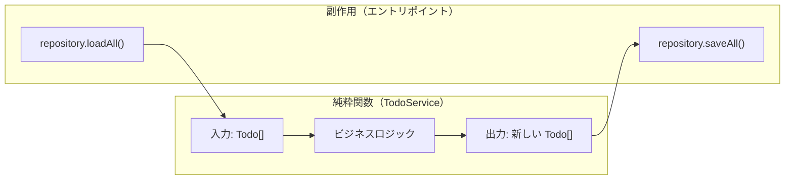
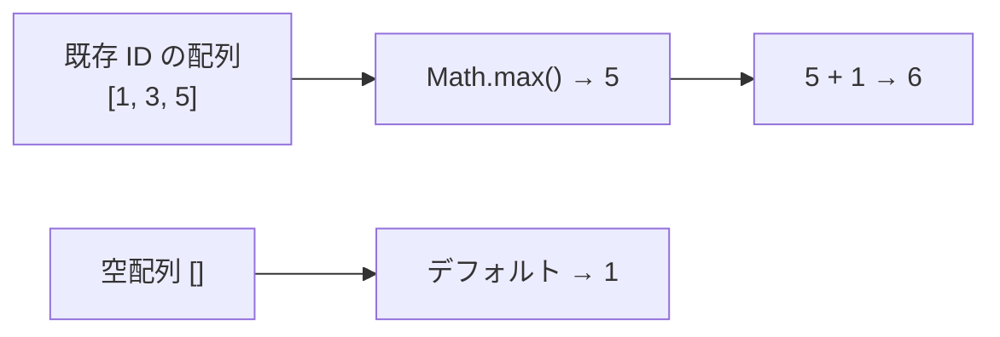
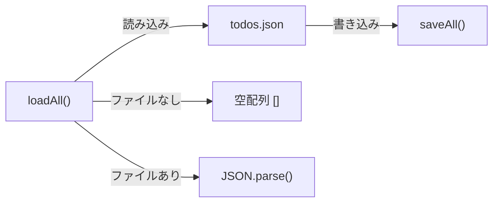
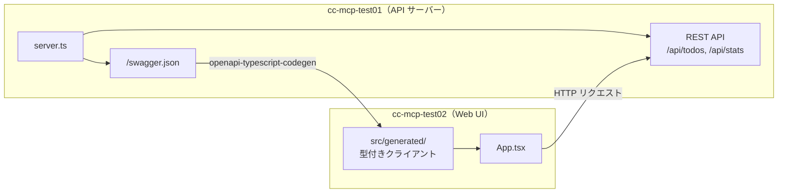
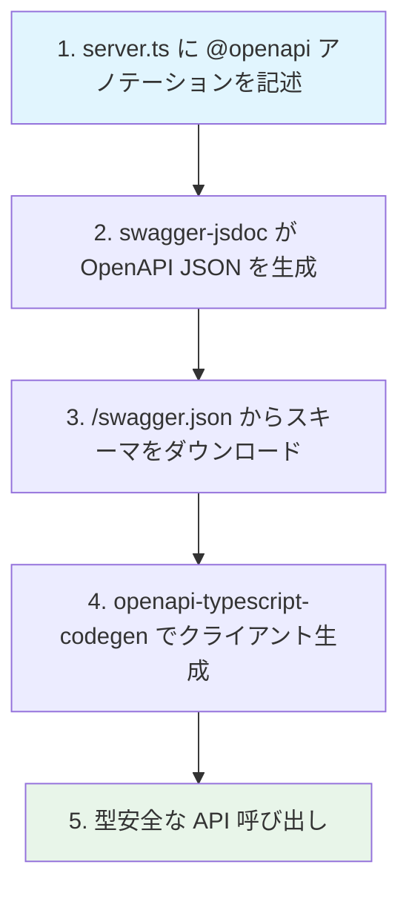

# 技術ドキュメント — アーキテクチャと依存関係

## 1. 概要

本ドキュメントでは cc-mcp-test01 のアーキテクチャ、モジュール構成、関数間の依存関係を定義します。

---

## 2. レイヤー構造

アプリケーションは 4 つのレイヤーで構成されています。上位レイヤーは下位レイヤーに依存しますが、逆方向の依存はありません。



### 2.1 レイヤー間の依存ルール

| # | ルール | 説明 |
|---|--------|------|
| 1 | 上位 → 下位のみ | レイヤー 1 は 2, 3, 4 を呼べる。逆方向の依存はない |
| 2 | 同一レイヤー間の依存なし | server.ts と index.ts は互いに依存しない |
| 3 | ビジネスロジックは副作用を持たない | TodoService は純粋関数。I/O はレイヤー 1 で行う |

---

## 3. モジュール依存関係

### 3.1 各モジュールのインポート一覧

| # | モジュール | インポート先 | 種別 |
|---|----------|-------------|------|
| 1 | `server.ts` | `repository.ts`, `service.ts`, `utils.ts` | プロジェクト内 |
| 2 | `server.ts` | `express`, `swagger-jsdoc`, `swagger-ui-express` | 外部パッケージ |
| 3 | `index.ts` | `repository.ts`, `service.ts`, `utils.ts` | プロジェクト内 |
| 4 | `service.ts` | `types.ts` | プロジェクト内（型のみ） |
| 5 | `repository.ts` | `types.ts` | プロジェクト内（型のみ） |
| 6 | `repository.ts` | `fs`, `path` | Node.js 標準 |
| 7 | `utils.ts` | なし | 依存なし |
| 8 | `types.ts` | なし | 依存なし |

### 3.2 モジュール依存関係図



---

## 4. server.ts — REST API サーバーの構造

### 4.1 処理フロー



### 4.2 各エンドポイントの依存関係

| # | エンドポイント | TodoRepository | TodoService | formatDate |
|---|---------------|:--------------:|:-----------:|:----------:|
| 1 | GET /api/todos | loadAll | — | ○ |
| 2 | POST /api/todos | loadAll, saveAll | add | ○ |
| 3 | DELETE /api/todos/:id | loadAll, saveAll | delete | — |
| 4 | GET /api/stats | loadAll | getStats | ○ |

### 4.3 OpenAPI スキーマ生成フロー



---

## 5. index.ts — CLI の構造

### 5.1 処理フロー



---

## 6. TodoService — ビジネスロジック詳細

### 6.1 メソッド一覧

| # | メソッド | 入力 | 出力 | 副作用 |
|---|---------|------|------|--------|
| 1 | `add(todos, text)` | 既存配列 + テキスト | 新配列 + 追加されたTODO | なし |
| 2 | `delete(todos, id)` | 既存配列 + ID | 新配列 + 削除されたTODO / エラー | なし |
| 3 | `getStats(todos)` | 既存配列 | 件数 + 最新TODO | なし |

### 6.2 設計方針



- **イミュータブル**: 元の配列を変更せず、常に新しい配列を返す
- **副作用の分離**: ファイル I/O はエントリポイント（server.ts / index.ts）が担当
- **エラー表現**: 例外ではなく戻り値の型で表現（`{ error: string }` の union 型）

### 6.3 ID 採番ロジック



削除後に ID の隙間ができても、最大値 + 1 で採番するため衝突しません。

---

## 7. TodoRepository — データアクセス詳細

### 7.1 データフロー



### 7.2 テスタビリティ

コンストラクタで `dataFile` パスを注入可能です。テスト時に一時ファイルを指定することで、本番データに影響を与えずにテストできます。

```typescript
// 本番
const repo = new TodoRepository(); // → todos.json

// テスト
const repo = new TodoRepository("/tmp/test-todos.json");
```

---

## 8. クロスプロジェクト連携（cc-mcp-test02）

### 8.1 全体構成



### 8.2 スキーマ駆動開発フロー



| # | ステップ | 担当 | 成果物 |
|---|---------|------|--------|
| 1 | API 仕様定義 | cc-mcp-test01 | `@openapi` JSDoc アノテーション |
| 2 | スキーマ生成 | swagger-jsdoc | OpenAPI 3.0 JSON |
| 3 | スキーマ取得 | 手動 / CI | `swagger.json` ファイル |
| 4 | クライアント生成 | openapi-typescript-codegen | `src/generated/` |
| 5 | API 呼び出し | cc-mcp-test02 | 型安全な HTTP 通信 |
